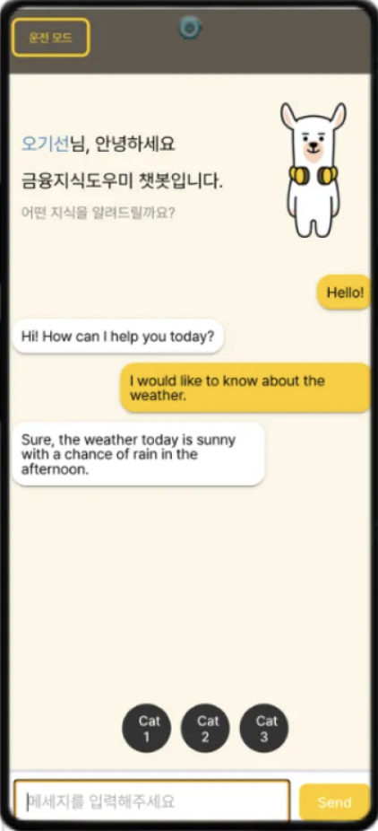
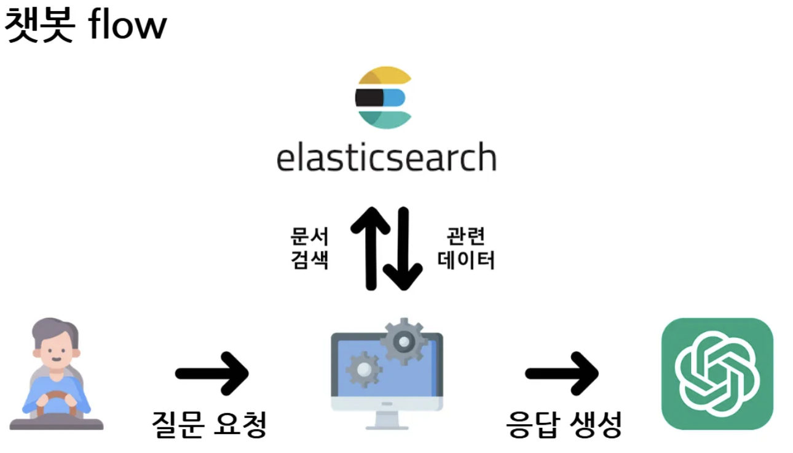
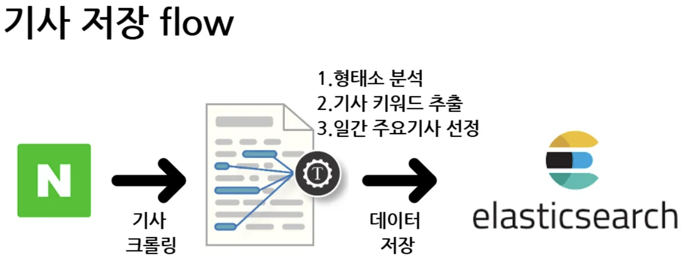

# 운전자를 위한 금융뉴스 챗봇(AI-RAG 활용 프로젝트)

## 발표 자료

### [발표PPT](https://www.canva.com/design/DAGVmvZ3ywY/JLHJb8NjCKkhThESFkjmRQ/view?utm_content=DAGVmvZ3ywY&utm_campaign=designshare&utm_medium=link&utm_source=editor)

### [시연영상](https://www.canva.com/design/DAGVmlYKoZc/O-p62rp_dharmXsp_tDgqA/view?utm_content=DAGVmlYKoZc&utm_campaign=designshare&utm_medium=link&utm_source=editor)
 

## 프로젝트 기간

**2024-07 ~ 2024-08**
  

## 서비스 타겟층

금융 지식을 얻고자 하는 사회초년생, 출퇴근 시 자차 활용 직장인, 대중교통을 사용하는 직장인
  

## 프로젝트 주요 기능

- **정확한 금융 정보 전달을 위한 RAG 방식 채택**
    
    금융 지식을 전달할 때 ChatGPT API의 할루시네이션 문제를 해결하기 위해 RAG(Retrieval-Augmented Generation) 방식을 채택하여 최신 금융 데이터를 기반으로 사용자에게 정확하고 신뢰성 있는 금융 정보를 제공합니다.  
    
- **실시간 데이터 분석과 맞춤형 뉴스 추천**
    
    실시간으로 크롤링한 금융 데이터를 분석하여 5개의 모델로 군집화하고, 이를 바탕으로 5개의 주요 뉴스를 사용자에게 추천합니다. 사용자는 원하는 뉴스를 선택해 볼 수 있으며, 선호 분야에 맞춰 자동으로 개인화된 금융 정보를 제공받을 수 있습니다.  

    
- **KB 금융 가이드 어체 사용 및 프롬프트 설계**
    
    프롬프트를 통해 KB 금융 가이드의 어체를 사용하도록 설정하였으며, GPT 응답에 추가 질문을 포함해 사용자가 질문을 원활히 이어갈 수 있도록 유도합니다. 또한, 쉬운 금융 용어로 답변을 제공하도록 프롬프트를 설정하여 금융 지식에 익숙하지 않은 사용자들도 쉽게 이해할 수 있습니다.  

    
- **일반 챗봇 모드와 음성 지원 모드 제공**
  
  프론트엔드에서는 일반 챗봇 모드와, 운전 시 음성으로 데이터를 주고받을 수 있는 모드를 제공합니다. 음성 모드에서는 사용자의 발화가 끝나는 시점을 감지해 자동으로 답변을 전송하도록 설계하여, 사용자가 손쉽게 정보에 접근할 수 있도록 편의성을 높였습니다.

 

## 기획배경

금융 지식의 차이가 곧 기회의 차이로 이어지는 시대입니다. 

정보의 부족은 경제적 불평등을 심화시키지만, 인공지능 기술을 통해 그 격차를 줄일 수 있습니다.

출퇴근길, 단순한 이동 시간이 아닌, 당신의 금융 지식을 확장하는 소중한 시간으로 바꿔드리겠습니다.
  

## **서비스 화면**

 &nbsp;&nbsp;&nbsp;&nbsp;&nbsp;&nbsp;&nbsp; 

 

## 기획주제

Chat GPT, RAG를 결합한 음성 대화형 챗봇 서비스 [FinSkip]

**기술 스택**

**Front-End**

- React
- React Router DOM
- Vite
- TypeScript
- styled-components
- Emotion
- Material-UI
- ApexCharts
- Zustand
- Axios
- AWS SDK (Polly)
- ESLint
- Prettier
- PWA

**Back-End**

- Java
- Spring Boot
- Lombok
- Gradle
- JPA
- OPENAI API

**DB**

- MySQL
- Elasticsearch
- logstash

**Data**

- Python
- Django
- selenium
- bareunpy
- skickit-learn
- sentence-transformers
 
  

## **System Architecture**

 

## **역할 분담**

| 이름   | 역할               | 업무                                                                       |
| ------ | ------------------ | -------------------------------------------------------------------------- |
| 오기선 | 팀장, FE | UI/UX 및 기본 컴포넌트 설계, RAG 설계,  AI 회화 채팅 페이지 TTS/ STT 구현 |
| 윤주찬 | BE            | OPENAI API 연결, elasticsearch로 데이터 이관, RAG 파이프라인 구축, 대화 API 작성 |
| 이기영 | Data          | 뉴스기사 크롤링 API 작성, 형태소 분석 및 키워드 추출, 일간 주요 기사 선정 파이프라인 구축 |
